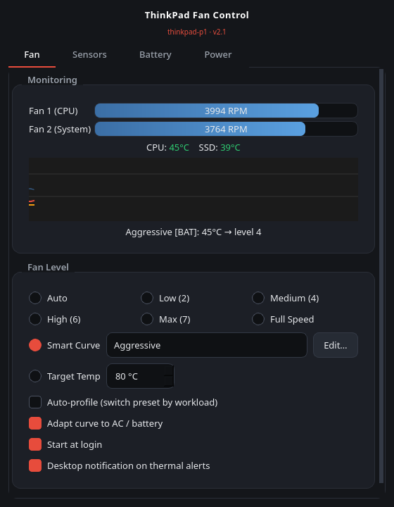
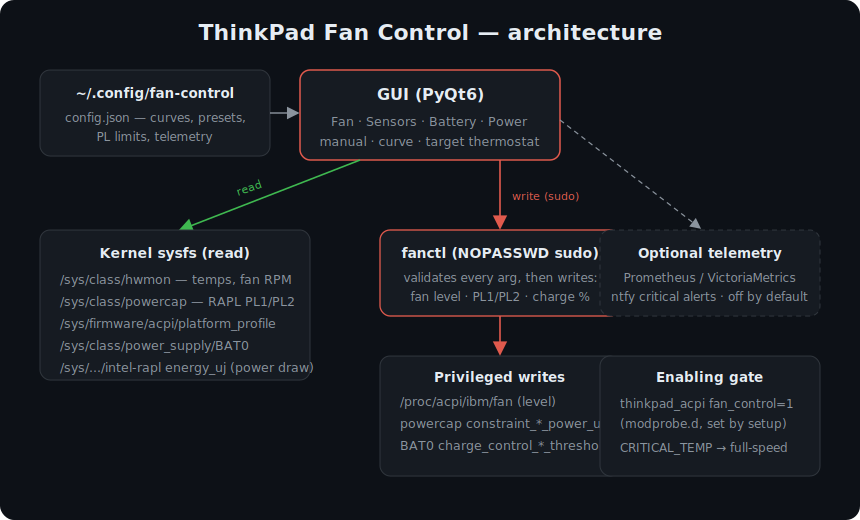

# ThinkPad Fan Control

A PyQt6 desktop app for controlling fans, thermals, CPU power limits, and battery
charge thresholds on Lenovo ThinkPads under Linux, via `thinkpad_acpi` and standard
kernel sysfs. Manual level, temperature curve, or closed-loop "hold this temperature"
thermostat — with a live temp/RPM graph and AC/battery-aware profiles.



## Features

- **Three modes** — Manual (pin a fixed level), Curve (temp → level with hysteresis,
  preset or custom), and Target (thermostat that adapts the fan to the workload).
- **AC / battery-aware** — separate curves and power presets, switched automatically on unplug.
- **CPU power limits (Intel RAPL)** — PL1/PL2 presets (Quiet → Max), with a built-in
  benchmark that runs a sustained load at each preset and compares steady-state clock/temp.
- **Battery longevity** — set charge start/stop thresholds.
- **Live graph** — temps, fan RPM, and measured package power draw; CSV export.
- **Auto-profile** — detects games / compiles / AI workloads and switches presets.
- **Critical-temp protection** — forces full-speed above a threshold, independent of the curve.
- **Optional telemetry** — push metrics to a Prometheus/VictoriaMetrics endpoint and fire
  ntfy alerts on critical temps. **Off by default; no endpoints preconfigured.**



## Requirements

- A Lenovo ThinkPad with the `thinkpad_acpi` kernel module (standard on Linux).
- Python 3 + PyQt6 (`pip install PyQt6`).
- `pkexec`/`sudo` for the one-time privileged setup.
- Optional: `stress-ng` for the in-app benchmark.

## Compatibility

Tested with **app version 2.1** on:

| ThinkPad model | CPU generation | Kernel |
|---|---|---|
| P1 Gen 3 | Intel 10th-gen (Comet Lake-H) | Linux 6.x |
| P1 Gen 4 | Intel 11th-gen (Tiger Lake-H) | Linux 6.x |

Everything it drives — `thinkpad_acpi` fan control, Intel RAPL power limits,
`platform_profile`, and `BAT0` charge thresholds — is common across recent ThinkPads,
and per-chassis details (fan count, hwmon indices, PL ceilings) are auto-detected;
missing sensors are handled gracefully. **Other models (incl. P1 Gen 2) very likely
work but are unverified** — reports welcome. Nothing here is model-hardcoded.

## Install

```
git clone <this-repo> && cd thinkpad-fan-control
sudo bash setup-fan-control.sh
python3 fan-control.py
```

`setup-fan-control.sh` (run once) installs the `fanctl` privileged helper to
`/usr/local/bin`, grants **passwordless sudo for that one command only**, and persists
`thinkpad_acpi fan_control=1` (the kernel gate that permits fan writes) via
`/etc/modprobe.d/`.

### Run at login (systemd user service)

```
cp systemd/fan-control.service ~/.config/systemd/user/ && systemctl --user enable --now fan-control.service
```

## How it works

The GUI only **reads** kernel sysfs directly (`/sys/class/hwmon`, `/sys/class/powercap`,
`platform_profile`, `BAT0`). Every **privileged write** goes through `fanctl`, a small
shell helper that validates its arguments before touching `/proc/acpi/ibm/fan`, the RAPL
power-limit files, or the battery thresholds — so the passwordless-sudo grant is scoped
to one auditable command, not to arbitrary root writes.

## Configuration

Settings live in `~/.config/fan-control/config.json` (curves, presets, PL limits,
telemetry). See `config.example.json`. The app rewrites this file on exit, so edit it
only while the app is stopped.

## Optional telemetry

Disabled by default with no endpoints set. To enable, fill in `telemetry.vm_url`
(Prometheus/VictoriaMetrics import URL) and/or `telemetry.ntfy_url` + `ntfy_topic`,
and set `telemetry.enabled: true`.

## Safety

This app writes fan levels and CPU power limits. Curves are pre-ramped (idle above a
dead stop) so a fan isn't spooling from standstill under a sudden all-core load, and a
critical-temperature failsafe forces full speed regardless of the active curve. Still,
you are overriding firmware defaults — understand your hardware's limits.

## License

MIT — see [LICENSE](LICENSE).
